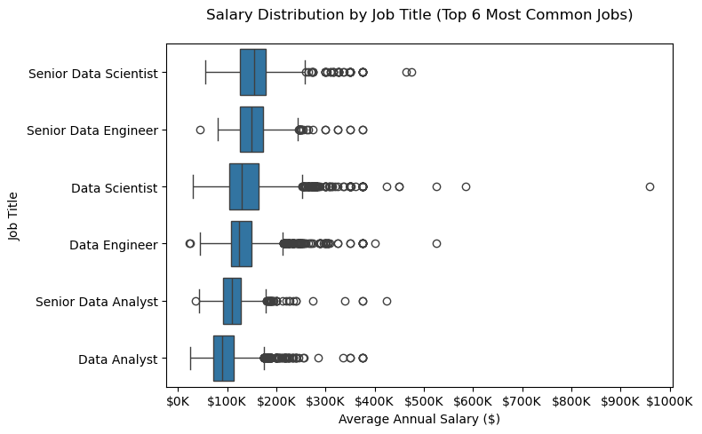

# OVERVIEW 
Welcome to my analysis of the data job market, focusing on data analyst roles. This project was created out of a desire to navigate and understand the job market more effectively. It delves into the top-paying and in-demand skills to help find optimal job opportunities for data analysts.

The data sourced from Luke Barousse's Python Course which provides a foundation for my analysis, containing detailed information on job titles, salaries, locations, and essential skills. Through a series of Python scripts, I explore key questions such as the most demanded skills, salary trends, and the intersection of demand and salary in data analytics.

# THE QUESTIONS

Below are the questions I want to answer in my project:

1. What are the skills most in demand for the top 3 most popular data roles?
2. How are in-demand skills trending for Data Analysts?
3. How well do jobs and skills pay for Data Analysts?
4. What are the optimal skills for data analysts to learn? (High Demand AND High Paying)

# TOOLS I USED 
For my deep dive into the data analyst job market, I harnessed the power of several key tools:

- Python: The backbone of my analysis, allowing me to analyze the data and find critical insights.I also used the following Python libraries:
  - Pandas Library: This was used to analyze the data.
  - Matplotlib Library: I visualized the data.
  - Seaborn Library: Helped me create more advanced visuals.
- Jupyter Notebooks: The tool I used to run my Python scripts which let me easily include my notes and analysis.
- Visual Studio Code: My go-to for executing my Python scripts.
- Git & GitHub: Essential for version control and sharing my Python code and analysis, ensuring collaboration and project tracking.

# DATA PREPERATION AND CLEANUP
This section outlines the steps taken to prepare the data for analysis, ensuring accuracy and usability.

## Import & Clean Up Data
I start by importing necessary libraries and loading the dataset, followed by initial data cleaning tasks to ensure data quality.

```python
# Importing librairies
import matplotlib.pyplot as plt
import pandas as pd
import seaborn as sns
from datasets import load_dataset
import ast

# Loading data
dataset = load_dataset('lukebarousse/data_jobs')
df = pd.DataFrame(dataset['train'])

# Data Cleanup
df['job_posted_date'] = pd.to_datetime(df['job_posted_date'])
df['job_skills'] = df['job_skills'].apply(lambda skills : ast.literal_eval(skills) if pd.notna(skills) else skills)
```

# The Analysis 

## 1. What are the most demanded skills for the top 3 most popular data roles?
To find the most demanded skills for the top 3 most popular data roles. I filtered out those positions by which ones were the most popular, and got the top 5 skills for these top 3 roles. This query highlights the most popular job titles and their top skills, showing which skills I should pay attention to depending on the role I'm targeting.

View my notebook with detailed steps here: 
[2_skills_demand.ipynb](./Project/2_skills_demand.ipynb)


### Results 


### Insights
• Different top skills are prioritized across data roles:
  - Data Analysts: SQL (14.1%) and Excel (11.3%) lead
  - Data Scientists: Python (13.5%) and SQL (9.5%) dominate
  - Data Engineers: SQL (9.6%) and Python (9.2%) are nearly equal

• SQL appears in the top 2 skills for all three roles, highlighting its fundamental importance in data fields

• Python is highly versatile, ranking high across all roles but especially for Data Scientists (13.5%)

• Each role has unique technical requirements:
  - Analysts: More focused on visualization tools (Tableau) and Excel
  - Scientists: Require statistical programming (R, SAS)
  - Engineers: Need cloud platforms (AWS, Azure) and data processing frameworks (Spark)

• The skill requirements reflect the nature of each role:
  - Analysts: Data visualization and reporting
  - Scientists: Statistical analysis and modeling
  - Engineers: Data infrastructure and pipelines

• The percentage differences suggest Data Analysts have more concentrated skill requirements (larger gaps between percentages) compared to Data Engineers (smaller gaps between skills)

## 2. How are in-demand skills trending for data analysts over the months?
To find how skills are trending in 2023 for Data Analysts, I filtered data analyst positions and grouped the skills by the month of the job postings. This got me the top 5 skills of data analysts by month, showing how popular skills were throughout 2023.

View my notebook with detailed steps here: 
[3_skills_trend.ipynb](./Project/3_skills_trend.ipynb)

### Results

*Bar graph visualizing the salary for the top 3 data roles and their top 5 skills associated with each.*

### Insights
Here are the key insights from the visualization:

- SQL skills are the most in-demand throughout the year, with a peak in the first half.
- Excel skills start high but decline steadily over the year.
- Tableau skills fluctuate, with a dip in the middle of the year.
- Python and SAS skills remain relatively stable but at lower levels compared to SQL and Excel.
- There are clear seasonal variations in the demand for certain skills across the months.
- The most dramatic changes occur for Excel, which drops from the highest to the lowest by the end of the year.
- Tableau shows the most erratic behavior, with sharp ups and downs in its percentage.

## 3. How well do jobs and skills pay for data roles?
Our code allows us to create a horizontal boxplot showing the salary distribution for the top 6 most common data-related jobs, sorted by median salary in descending order, with salary labels displayed in $K format.

View my notebook with detailed steps here: 
[4_salary_analysis.ipynb](./Project/4_salary_analysis.ipynb)


### Visualise data 

*Box plot visualizing the salary distributions for the top 6 data job titles.*

### Insights
Here are the 3 key insights from this visualization:

- "Senior" positions (Senior Data Scientist/Engineer) show the highest median salaries, ranging between $150K-$200K, confirming salary progression with experience.

- The salary distributions are right-skewed with numerous outliers towards high salaries, particularly for Data Scientists who can exceptionally reach up to $1000K.

- Analyst positions (Data Analyst/Senior Data Analyst) have the lowest median salaries in the sample, around $100K, and show less dispersion towards high salaries.

### Highest Paid & Most Demanded Skills for Data Analysts
Next, I narrowed my analysis and focused only on data analyst roles. I looked at the highest-paid skills and the most in-demand skills. I used two bar charts to showcase these.

### Results

* Two separate bar graphs visualizing the highest paid skills and most in-demand skills for data analysts in the US.*

### Insights

• Top-paying skills (dplyr, bitbucket, gitlab) are specialized technical tools, with salaries around $180-200K/year

• There's a significant salary gap between the highest-paid skills (about $180-200K) and the most in-demand skills (about $80K)

• Office tools (Excel, Word, PowerPoint) are among the most in-demand skills but are the lowest paid

• Python, despite being highly in-demand, offers a relatively modest median salary (~$80K) compared to specialized skills

• Development and code management tools (gitlab, bitbucket) are among the highest-paid but don't appear in the most in-demand skills

• R and Tableau are among the most sought-after skills for Data Analysts in the United States

## 4. What are the most optimal skills to learn as a data analyst in the US ?

To identify the most optimal skills to learn ( the ones that are the highest paid and highest in demand) I calculated the percent of skill demand and the median salary of these skills. To easily identify which are the most optimal skills to learn.

View my notebook with detailed steps here: 
[5_optimal_skills.ipynb](./Project/5_optimal_skills.ipynb)
### Results

*A scatter plot visualising the most optimal skills (high paying and high demand) for data analysts in the US.*
- Programming skills lead in salary, while databases dominate in demand:

  Python (programming) offers the highest median salary (about $98,000), making it the most financially rewarding skill in this dataset.
  SQL (databases) has unparalleled demand, appearing in nearly 60% of job postings, while still maintaining a high median salary (about $94,000). This highlights the dual importance of database management and programming skills in the job market.
- Analyst tools vary in demand and salary impact:

  Excel, categorized as an analyst tool, is required in 40% of job postings, making it the most sought-after among its group. However, its median salary ($88,000) is moderate.
  Conversely, Power BI and Tableau, also analyst tools, show significantly less demand but have slightly higher salaries (about $90,000–$92,000), indicating that these specialized tools are valued in more niche roles.
- Cloud and Office skills have a smaller but notable role:

  Oracle (cloud) commands a relatively high salary (about $96,000), but its demand is limited.
  Meanwhile, common office tools like Word and PowerPoint, despite being widely required, are linked with lower median salaries (about $82,000–$84,000), underlining the limited career leverage of these basic skills.

# WHAT I LEARNED 
Throughout this project, I deepened my understanding of the data analyst job market and enhanced my technical skills in Python, especially in data manipulation and visualization. Here are a few specific things I learned:

- Advanced Python Usage: Utilizing libraries such as Pandas for data manipulation, Seaborn and Matplotlib for data visualization, and other libraries helped me perform complex data analysis tasks more efficiently.
- Data Cleaning Importance: I learned that thorough data cleaning and preparation are crucial before any analysis can be conducted, ensuring the accuracy of insights derived from the data.
- Strategic Skill Analysis: The project emphasized the importance of aligning one's skills with market demand. Understanding the relationship between skill demand, salary, and job availability allows for more strategic career planning in the tech industry.

# CHALLENGES I FACED 
This project was not without its challenges, but it provided good learning opportunities:

- Data Inconsistencies: Handling missing or inconsistent data entries requires careful consideration and thorough data-cleaning techniques to ensure the integrity of the analysis.
- Complex Data Visualization: Designing effective visual representations of complex datasets was challenging but critical for conveying insights clearly and compellingly.
- Balancing Breadth and Depth: Deciding how deeply to dive into each analysis while maintaining a broad overview of the data landscape required constant balancing to ensure comprehensive coverage without getting lost in details.